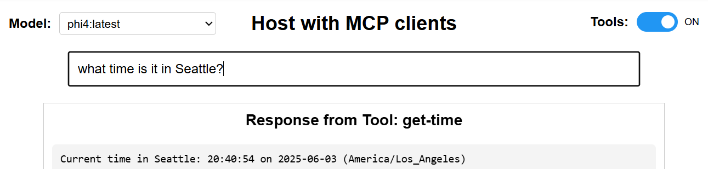
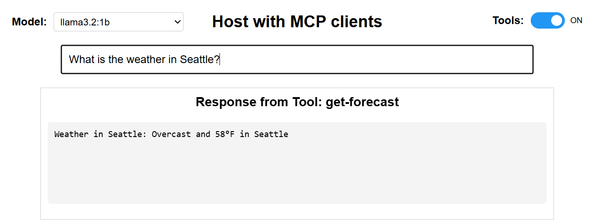
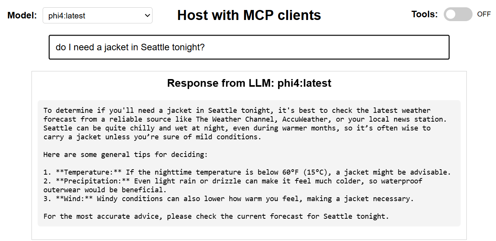

# MCP Docker Demo

A Docker-based demonstration of the [Model Context Protocol (MCP)](https://modelcontextprotocol.io/) with weather forecasting and time services.

## Project Overview

This project demonstrates how to build and deploy MCP-compliant tools using Docker containers. It showcases a complete web application architecture with:

1. **MCP Weather Tool** - Provides weather forecasts for any location
2. **MCP Time Tool** - Returns current time and timezone information
3. **HTTP Bridge Service** - Translates between web requests and MCP protocol
4. **Web Frontend** - Browser interface with Ollama LLM integration and intelligent tool routing

## Architecture

```
Browser → Frontend Container → Bridge Container → MCP Tools
   ↓             ↓                    ↓              ↓
HTML/JS    (Port 8080)         (Port 5000)    Python Scripts
```

The system uses a microservices architecture where:
- **Frontend Container**: Serves the web interface
- **Bridge Container**: Hosts the Flask API and executes MCP tools
- **MCP Tools**: Run as subprocesses within the bridge container

## Screenshots

### Time Tool Example


### Weather Tool Example


### LLM Fallback with No Tools


## Project Structure

```
MCP_Docker-Demo/
├── bridge/
│   ├── Dockerfile
│   └── bridge.py              # Flask HTTP bridge service
├── frontend/
│   ├── Dockerfile
│   ├── mcp_host.html         # Web interface
│   └── styles.css            # Styling
├── weather-server/
│   └── server.py             # MCP weather tool
├── time-server/
│   └── server.py             # MCP time tool
├── docker-compose.yml        # Container orchestration
└── README.md
```

## Components

### Bridge Service (`bridge/bridge.py`)

A Flask-based HTTP service that acts as a bridge between web browsers and MCP tools:
- Receives HTTP POST requests with JSON payloads
- Translates them into MCP protocol format
- Executes MCP tools as subprocesses via stdin/stdout
- Returns formatted JSON responses to the browser
- Handles CORS for browser compatibility

### Weather Tool (`weather-server/server.py`)

An MCP-compliant tool that provides weather forecasts:
- Uses wttr.in API for weather data
- Falls back to mock data if API is unavailable
- Follows MCP protocol for stdin/stdout communication
- Implements the `get-forecast` tool

### Time Tool (`time-server/server.py`)

An MCP-compliant tool that provides time information:
- Uses OpenStreetMap for geocoding locations
- Estimates timezones based on geographical coordinates
- Implements the `get-time` tool
- Returns local time, date, and timezone information

### Web Frontend (`frontend/mcp_host.html`)

A responsive web interface that provides:
- Model selection from available Ollama models
- Toggle switch for enabling/disabling tools
- Pattern-based routing to appropriate MCP tools
- Fallback to LLM for general queries
- Clear attribution of response sources (Tool vs LLM)

## Getting Started

### Prerequisites

- [Docker](https://www.docker.com/get-started) and Docker Compose
- [Ollama](https://ollama.ai/) running locally with at least one model installed

### Quick Start

1. **Clone the repository:**
   ```bash
   git clone https://github.com/yourusername/MCP_Docker-Demo.git
   cd MCP_Docker-Demo
   ```

2. **Start the services:**
   ```bash
   docker-compose up --build
   ```

3. **Open the web interface:**
   ```
   http://localhost:8080/mcp_host.html
   ```

4. **Try example queries:**
   - "What's the weather in Seattle?"
   - "What time is it in Tokyo?"
   - "Tell me about quantum physics" (falls back to LLM)

### Development Mode

For faster development iterations, you can restart individual services:

```bash
# Restart frontend only (for HTML/CSS changes)
docker-compose restart frontend

# Rebuild and restart bridge (for Python changes)
docker-compose build bridge
docker-compose up
```

## How It Works

### Query Flow

1. **User Input**: User types a natural language query in the web interface
2. **Pattern Matching**: JavaScript regex patterns determine if the query matches a tool
3. **Tool Execution**: If matched, HTTP request is sent to the bridge service
4. **MCP Protocol**: Bridge translates HTTP to MCP format and executes the tool
5. **Response**: Tool output is returned through the bridge to the browser
6. **LLM Fallback**: If no tool matches, query is sent directly to Ollama

### MCP Protocol Translation

```
HTTP Request:  {"location": "Seattle"}
      ↓
MCP Format:    {"type": "tool-call", "tool": "get-forecast", "input": {"location": "Seattle"}}
      ↓
MCP Response:  {"type": "tool-result", "output": {"location": "Seattle", "forecast": "..."}}
      ↓
HTTP Response: {"location": "Seattle", "forecast": "..."}
```

## API Testing

You can test the bridge service directly using curl:

```bash
# Test weather endpoint
curl -X POST http://localhost:5000/weather \
  -H "Content-Type: application/json" \
  -d '{"location":"Seattle"}'

# Test time endpoint
curl -X POST http://localhost:5000/time \
  -H "Content-Type: application/json" \
  -d '{"location":"Tokyo"}'
```

## Configuration

### Port Configuration

- **Frontend**: `8080` (configurable in docker-compose.yml)
- **Bridge**: `5000` (configurable in docker-compose.yml)
- **Ollama**: `11434` (default Ollama port on host machine)

### Adding New Tools

To add a new MCP tool:

1. Create a new directory (e.g., `calculator-server/`)
2. Implement your tool following the MCP protocol (see existing tools as examples)
3. Add the tool directory to the bridge container in `bridge/Dockerfile`
4. Add a new endpoint in `bridge/bridge.py`
5. Add pattern matching in the frontend HTML

## Troubleshooting

### Common Issues

- **"Failed to fetch" errors**: Ensure Ollama is running on port 11434
- **Tool execution errors**: Check Docker logs with `docker-compose logs bridge`
- **Frontend not loading**: Verify the frontend container is running on port 8080

### Viewing Logs

```bash
# View all logs
docker-compose logs

# View specific service logs
docker-compose logs bridge
docker-compose logs frontend
```

## License

MIT

## Contributing

Contributions are welcome! This demo provides a foundation for exploring the Model Context Protocol with Docker. Some areas for expansion:

### Potential New Tools
- **Calculator Tool**: Mathematical computations
- **File Search Tool**: Search local filesystem
- **API Client Tool**: Generic REST API client
- **Database Query Tool**: Simple database operations

### Enhancement Ideas
- **Tool Discovery**: Dynamic tool registration and discovery
- **Authentication**: Add API key management
- **Monitoring**: Add health checks and metrics
- **Performance**: Implement tool response caching

### Contribution Steps

1. Fork the repository
2. Create a feature branch (`git checkout -b feature/new-tool`)
3. Implement your changes following the existing patterns
4. Test with Docker Compose
5. Update documentation
6. Submit a pull request

For questions or discussions about MCP integration patterns, feel free to open an issue!

