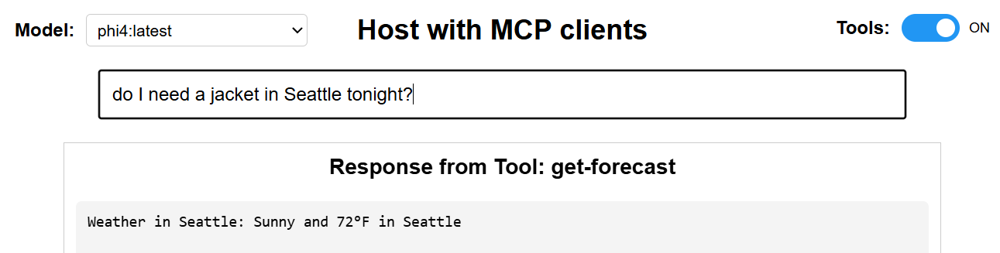

# MCP Client and Server Demo

A demonstration of the [Model Context Protocol (MCP)](https://modelcontextprotocol.io/) with weather forecasting and time services.

## Project Overview

This project demonstrates how to build and use MCP-compliant tools with real-world examples. It includes:

1. An MCP-compliant weather server with forecast capabilities
2. An MCP-compliant time server with geocoding and timezone detection
3. A generic HTTP bridge for integrating MCP tools with web applications
4. A web UI that connects to Ollama LLM with automatic tool routing


## Screenshots

### Web UI


### Weather Tool Example


### Time Tool Example


## Project Structure

```
MCP-Demo/
├── weather-server/
│   └── server.py
├── time-server/
│   └── server.py
├── mcp_http_bridge.py
├── run_bridge.py
├── mcp_host.html
├── styles.css
├── requirements.txt
├── LICENSE
├── .gitignore
└── README.md
```

## Components

### Weather Tool Server (`weather-server/server.py`)

An MCP-compliant tool that provides weather forecasts. It:
- Advertises its capabilities via the MCP tool description format
- Implements the `get-forecast` tool with real API integration
- Communicates via stdin/stdout following the MCP protocol
- Includes proper error handling and validation

### Time Tool Server (`time-server/server.py`)

An MCP-compliant tool that provides time information. It:
- Advertises its capabilities via the MCP tool description format
- Implements the `get-time` tool for any location
- Uses OpenStreetMap for geocoding and TimeAPI.io for time data
- Properly handles errors and edge cases

### Generic HTTP Bridge (`mcp_http_bridge.py`)

A FastAPI server that can expose any MCP tool as a REST API. It:
- Dynamically discovers and exposes tool capabilities
- Manages the lifecycle of the MCP tool subprocess
- Translates between HTTP and MCP protocols
- Provides CORS support for web integration

### Bridge Runner (`run_bridge.py`)

A utility script that makes it easy to launch HTTP bridges:
- Configurable server path and port
- Simple command-line interface
- Launches the appropriate FastAPI server

### Web UI with Ollama Integration (`mcp_host.html` & `styles.css`)

A web interface that allows users to:
- Select from available Ollama models
- Toggle MCP tools on/off
- Enter natural language queries
- Get automatic routing to the appropriate tool based on query content
- See responses with attribution (Tool vs LLM)

## Getting Started

### Prerequisites

- Python 3.7+
- [Ollama](https://ollama.ai/) installed locally for LLM integration

### Installation

Install all required packages using the provided requirements.txt file:

`pip install -r requirements.txt`

This will install all necessary dependencies including `fastapi`, `uvicorn`, `requests`, `pydantic`, and other required packages.

### Running the Demo

1. Start the HTTP bridges for both tools:
   ```
   # Start the weather tool bridge
   python run_bridge.py --server-path="./weather-server/server.py" --port=5001
   
   # Start the time tool bridge (in another terminal)
   python run_bridge.py --server-path="./time-server/server.py" --port=5002
   ```

2. Make sure Ollama is running locally with at least 1 model loaded

3. Start a simple HTTP server to serve the HTML file:
   ```
   python -m http.server 8000
   ```

4. Open `http://localhost:8000/mcp_host.html` in a web browser

5. Try queries like:
   - "What's the weather in Seattle?"
   - "What time is it in Tokyo?"
   - "Tell me about quantum physics" (falls back to LLM)


## How It Works

1. The web interface detects the type of query using regex patterns
2. Based on the pattern match, it routes to the appropriate MCP tool
3. If no pattern matches, it falls back to the LLM for general responses
4. The HTTP bridge manages communication with the MCP tool
5. Results are displayed in the web interface with attribution

## MCP Protocol Flow

This implementation follows the standard MCP protocol flow:
1. Tool server outputs tool description JSON
2. HTTP bridge reads description and exposes appropriate endpoints
3. Web UI sends a tool call to the matching endpoint based on query
4. Tool processes the request and returns a result
5. UI receives and displays the result with appropriate attribution

## Screenshots

### Time Tool Example


### Weather Tool Example


### Web UI


## License

MIT

## Contributing

I welcome contributions to expand this demonstration of the Model Context Protocol! Here are some ways you can contribute:

### Adding New MCP Tools

This demo includes weather and time tools, but many other tools could be integrated:

1. **Calculator Tool**: Implement basic or scientific calculations with natural language parsing
2. **URL Shortener Tool**: Create a simple service to shorten URLs
3. **Dictionary/Thesaurus Tool**: Build a word lookup service using free dictionary APIs
4. **Note-taking Tool**: Implement a simple note storage and retrieval system

### Contribution Steps

1. Fork the repository
2. Create your feature branch (`git checkout -b feature/calculator-tool`)
3. Create your tool following the MCP protocol (use existing tools as templates)
4. Update documentation to include your new tool
5. Commit your changes (`git commit -m 'Add calculator tool'`)
6. Push to the branch (`git push origin feature/calculator-tool`)
7. Open a Pull Request

### Development Guidelines

- Ensure your tool follows the MCP protocol specification
- Include comprehensive error handling
- Document your tool's capabilities in the README
- Add example queries for your tool

I'm excited to see what MCP tools you build!

